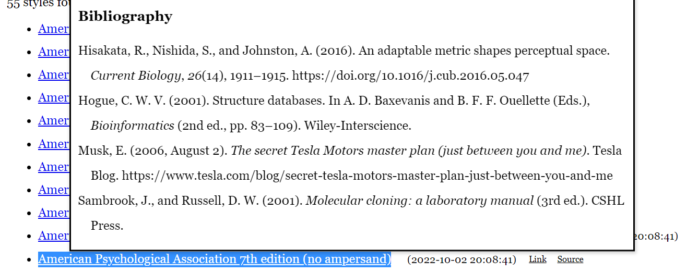
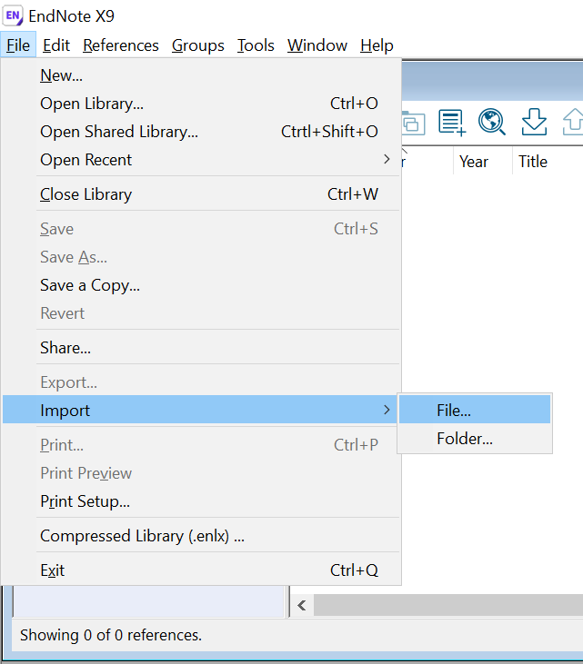
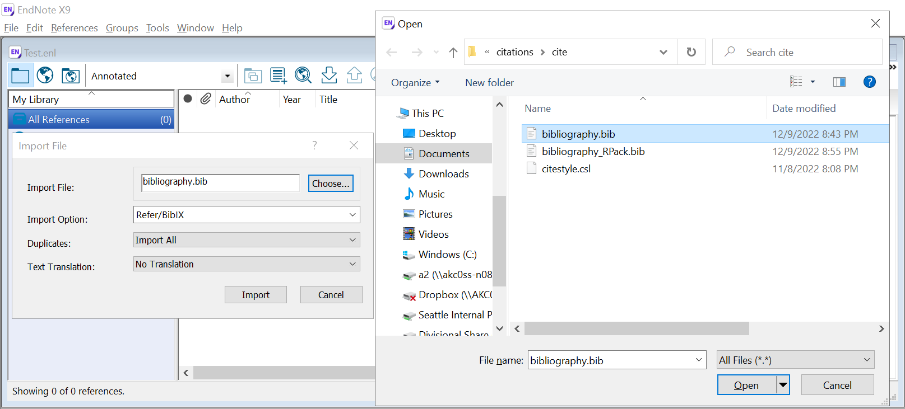
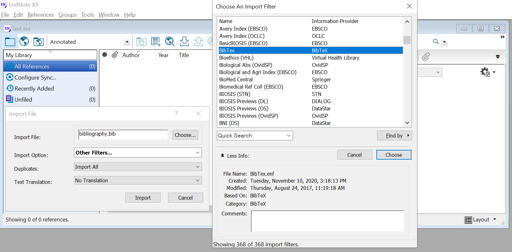

<!-- README.md is generated from README.Rmd. Please edit that file -->

# [AFSC RACE GAP Citations Resource](https://github.com/afsc-gap-products/citations) 

The scripts therein reproducibly produce our citations for our data,
annual data reports, presentations, and other outreach documents.

> This code is always in development. Find code used for various reports
> in the code
> [releases](paste0(https://github.com/afsc-gap-products/citations,%20%22/releases%22)).

## This code is primarally maintained by:

**Emily Markowitz** (Emily.Markowitz AT noaa.gov;
[@EmilyMarkowitz-NOAA](https://github.com/EmilyMarkowitz-NOAA))

\[Previously\] **Liz Dawson** (Liz.Dawson AT noaa.gov;
[@liz-dawson-NOAA](https://github.com/liz-dawson-NOAA))

Alaska Fisheries Science Center,

National Marine Fisheries Service,

National Oceanic and Atmospheric Administration,

Seattle, WA 98115

# Table of contents

> - [*Objective*](#objective)
> - [*Citation style guides*](#citation-style-guides)
> - [*BibTeX citation format*](#bibtex-citation-format)
> - [*How to use this citation
>   resouce*](#how-to-use-this-citation-resouce)
>   - [*Latest citations*](#latest-citations)
>   - [*Sourcing directly from github*](#sourcing-directly-from-github)
>   - [*As a local file in R*](#as-a-local-file-in-r)
>   - [*As a local file Endnote, Zotero, or other citation
>     manager*](#as-a-local-file-endnote,-zotero,-or-other-citation-manager)
> - [*Citation files in action*](#citation-files-in-action)
> - [*Contribute to this repo and community `.bib`
>   file*](#contribute-to-this-repo-and-community-%60.bib%60-file)
>   - [*Bibliography syntax notes*](#bibliography-syntax-notes)
>   - [*Bibliography examples*](#bibliography-examples)
>     - [*NOAA technical memorandums/process
>       reports*](#noaa-technical-memorandums/process-reports)
>     - [*NOAA Stock Assessments*](#noaa-stock-assessments)
>     - [*Journal articles*](#journal-articles)
>     - [*Presentations*](#presentations)
>     - [*Data*](#data)
>     - [*R packages built in-house*](#r-packages-built-in-house)
>     - [*Legislation*](#legislation)
>     - [*Web pages*](#web-pages)
>     - [*Books*](#books)
> - [*Cite all R packages on a computer or used in a
>   project*](#cite-all-r-packages-on-a-computer-or-used-in-a-project)
> - [*Other resources*](#other-resources)
> - [*Suggestions and Comments*](#suggestions-and-comments)
>   - [*R Version Metadata*](#r-version-metadata)
>   - [*NOAA README*](#noaa-readme)
>   - [*NOAA License*](#noaa-license)

# Objective

> As you, a GAP team member, publishes, that publication should be
> codified and linked within the `bibliography.bib` file so you and your
> peers accurately and appropriately cite your work. Learn how to
> contribute in the [*Suggestions and
> Comments*](#suggestions-and-comments) section.

**A shared citation repository has several benefits for the team:**

- We all consistently format and use the most up-to-date citations
- We have an increasingly-complete list of all papers done by us and our
  colleagues
- The bib file is very versatile and can be pulled directly into any
  project by URL link
- We can manage our citations as a group instead of individually (e.g.,
  as if we all shared an Endnote, Zotero, or other citation manager)
- We can collectively add and improve citations as new papers, data
  products, websites, presentatinos, and other resources are published

**What citations should be added to the
[`bibliography.bib`](https://github.com/afsc-gap-products/citations/cite/bibliography.bib)
file in this repository?**

- journal articles
- tech memos
- stock assessments
- data
- websites
- laws and regulation
- presentations
- … and more! Any resource that anyone in the GAP group may need to
  cite!

> \*\*Find a print out of all of the citations currently included in
> this repo’s
> [`bibliography.bib`](https://github.com/afsc-gap-products/citations/cite/bibliography.bib)
> in this [pdf
> document](https://github.com/afsc-gap-products/citations/blob/main/testing/print_bib.pdf).\*
> \*

# Citation style guides

Citation styles provide the particular formats for in-text citations and
bibliographies that appear in your research paper. Usually, the choice
of citation style will be based on the discipline in which you are
writing. Often a journal will indicate the citation style he/she would
like you to use.

The NOAA Library now recommends that we use [American Psychological
Association 7th edition (no
ampersand)](https://www.zotero.org/styles/apa-no-ampersand) for citing
in NOAA technical memorandums and other NOAA process report
publications. Learn more about APA 7th from this [Purdue
Owl](https://owl.purdue.edu/owl/research_and_citation/apa_style/apa_formatting_and_style_guide/reference_list_author_authors.html)
resoure.

<figure>

<figcaption aria-hidden="true">APA 7th no Ampersand</figcaption>
</figure>

The citation style guide for APA 7th can be downloaded from
[github](https://github.com/citation-style-language/styles). This
independent open source Citation Style Language (CSL) project aims to
facilitate scholarly communication by automating the formatting of
citations and bibliographies.

# BibTeX citation format

BibTex is a bibliographic tool that is used with LaTeX to help organize
the user’s references and create a bibliography. A BibTex user creates a
bibliography file that is separate from the LaTeX source file, with a
file extension of .bib. Each reference in the bibliography file is
formatted with a certain structure and is given a “key” by which the
author can refer to it in the source file.

# How to use this citation resouce

## Latest citations

- **Aleutian Islands (AI)** (Von Szalay et al., 2023)
  - Triennial (1990s)/Biennial since 2000 in even years
  - Modified Index-Stratified Random of Successful Stations Survey
    Design
- **Eastern Bering Sea Slope (BSS)** (Hoff, 2016)
  - Intermittent (funding dependent)
  - Modified Index-Stratified Random of Successful Stations Survey
    Design
- **Eastern Bering Sea Shelf (EBS)** (Markowitz et al., 2024)
  - Annual
  - Fixed stations at center of 20 x 20 nm grid
- **Gulf of Alaska (GOA)** (Siple et al., 2024)
  - Triennial (1990s)/Biennial since 2001 in odd years
  - Stratified Random Survey Design
- **Northern Bering Sea (NBS)** (Markowitz et al., 2024)
  - Biennial/Annual
  - Fixed stations at center of 20 x 20 nm grid

## Sourcing directly from github

Sourcing directly from github requires internet access, but ensures that
you will always have the most up to date citation style library and
bibliography references.

``` r
---
title: "untitled"
date: "`r paste0(format(Sys.time(), '%B %d, %Y'))`"
output: html_document
csl: "https://raw.githubusercontent.com/citation-style-language/styles/master/apa-no-ampersand.csl"
bibliography: "https://raw.githubusercontent.com/afsc-gap-products/citations/main/cite/bibliography.bib"
---
```

## As a local file in R

To download the CSL and save it to your project, you can use the
following code:

``` r
csl <- readLines("https://raw.githubusercontent.com/citation-style-language/styles/master/apa-no-ampersand.csl")
readr::write_lines(x = csl, file = "./cite/citestyle.csl")

bib <- readLines("https://raw.githubusercontent.com/afsc-gap-products/citations/main/cite/bibliography.bib")
readr::write_lines(x = bib, file = "./cite/bibliography.csl")
```

Add the link to the
[`.bib`](https://github.com/afsc-gap-products/citations/blob/main/cite/bibliography.bib)
and
[`.csl`](https://raw.githubusercontent.com/citation-style-language/styles/master/apa-no-ampersand.csl)
files in the YAML of your `rmarkdown` ro `quarto` file like so:

Note that “../” before the file names refers to directory navigation.

``` r
---
title: "untitled"
date: "`r paste0(format(Sys.time(), '%B %d, %Y'))`"
output: html_document
csl: "../cite/citestyle.csl"
bibliography: "../cite/bibliography.bib"
---
```

## As a local file Endnote, Zotero, or other citation manager

**Zotero**

[Watch this video](https://www.youtube.com/watch?v=bWQFzM1Eu34)

**Endnote**

*Doesn’t work as well as it should. Please submit a pull request or edit
this `README` if anyone finds a better solution. However, it should work
something like this:*

Step 1: Open EndNote and select `File` \> `Import` \> `File`

<figure>

<figcaption aria-hidden="true">Step 1: <code>File</code> &gt;
<code>Import</code> &gt; <code>File</code></figcaption>
</figure>

Step 2: Open EndNote and select the `.bib` file you wish to import.

<figure>

<figcaption aria-hidden="true">Step 2: Select the <code>.bib</code> file
you wish to import.</figcaption>
</figure>

Step 3: Select the import filter file you wish to import. For Bibtex,
you’ll have to select “Other filters” and then “BibTex”. However,
something seems to be wrong with the filter file and… it only kind of
works.

<figure>

<figcaption aria-hidden="true">Step 3: Select the import fiilter file
you wish to import. For Bibtex, you’ll have to select “Other filters”
and then “BibTex”. However, something seems to be wrong with the filter
file and… it only kind of works.</figcaption>
</figure>

# Citation files in action

Use the `[@...]` notation in your `rmarkdown` or `quarto` call a
reference number for a citation.

``` r
For example, here are **Annual Bering Sea Data Report** [@2022NEBS2023; @GOA2018; @AI2022; @RN979]. 
```

*Which renders as:* “For example, here are **Annual Bering Sea Data
Report** (Hoff, 2016; Markowitz et al., 2023; Von Szalay et al., 2023;
Von Szalay and Raring, 2018).”

Naturally, without writing anything else, references will appear at the
of the document. If you want them to render at a specific place in your
document, call this code `<div id="refs"></div>` which renders as:

<div id="refs" class="references csl-bib-body hanging-indent"
entry-spacing="0" line-spacing="2">

<div id="ref-RN979" class="csl-entry">

Hoff, G. R. (2016). *Results of the 2016 eastern Bering Sea upper
continental slope survey of groundfishes and invertebrate resources*
(NOAA Tech. Memo. NOAA-AFSC-339). U.S. Dep. Commer.
<https://doi.org/10.7289/V5/TM-AFSC-339>

</div>

<div id="ref-2022NEBS2023" class="csl-entry">

Markowitz, E. H., Dawson, E. J., Anderson, A. B., Rohan, S. K.,
Charriere, N. E., Prohaska, B. K., and Stevenson, D. E. (2023). *Results
of the 2022 eastern and northern Bering Sea continental shelf bottom
trawl survey of groundfish and invertebrate fauna* (NOAA Tech. Memo.
NMFS-AFSC-469; p. 213). U.S. Dep. Commer.
<https://doi.org/10.25923/rt50-th19>

</div>

<div id="ref-2023NEBS" class="csl-entry">

Markowitz, E. H., Dawson, E. J., Wassermann, S., Anderson, A. B., Rohan,
S. K., Charriere, B. K., and Stevenson, D. E. (2024). *Results of the
2023 eastern and northern Bering Sea continental shelf bottom trawl
survey of groundfish and invertebrate fauna* (NOAA Tech. Memo.
NMFS-AFSC-487; p. 242). U.S. Dep. Commer.
<https://doi.org/10.25923/2mry-yx09>

</div>

<div id="ref-GOA2023" class="csl-entry">

Siple, M. C., Szalay, P. G. von, Raring, N. W., Dowlin, A. N., and
Riggle, B. C. (2024). *Data report: 2023 gulf of alaska bottom trawl
survey* (NOAA Tech. Memo. AFSC processed report; 2024-09). U.S. Dep.
Commer. <https://doi.org/10.25923/gbb1-x748>

</div>

<div id="ref-GOA2018" class="csl-entry">

Von Szalay, P. G., and Raring, N. W. (2018). *Data report: 2017
<span class="nocase">Gulf of Alaska</span> bottom trawl survey* (NOAA
Tech. Memo. NMFS-AFSC-374). U.S. Dep. Commer.
<https://doi.org/10.7289/V5/TM-AFSC-374>

</div>

<div id="ref-AI2022" class="csl-entry">

Von Szalay, P. G., Raring, N. W., Siple, M. C., Dowlin, A. N., Riggle,
B. C., and Laman, E. A. and. (2023). *Data report: 2022 Aleutian Islands
bottom trawl survey* (AFSC Processed Rep. No. 2023-07; p. 230). U.S.
Dep. Commer. <https://doi.org/10.25923/85cy-g225>

</div>

</div>

# Contribute to this repo and community `.bib` file

This repository is meant to act as a resource for all members of GAP and
beyond. Do you see that a citation is missing from our `.bib` file,
needs to be edited or you have a new publication? Please add it by
submitting a [pull
request](https://github.com/afsc-gap-products/citations/pulls) or
speaking to one of the repository maintainers.

## Bibliography syntax notes

To learn more about the elements of a bibtext citation, refer to:

- <https://www.bibtex.com/g/bibtex-format/>
- <https://libguides.nps.edu/citation/ieee-bibtex>

Common formatting questions, answered (feel free to add!)

- **‘in review’ or ‘in press’**: use `year = {in review}` and
  `year = {in press}`, respectively.
- **Reference numbers must be unique**: When entering a new citation,
  ensure that the reference number is not used anywhere else in the
  `.bib` doc.
- **Finding pre-formatted citations**: While not perfect, the below
  resources can use DOIs or other paper identifiers to find and
  construct bibliographies in the right format for you:
  - <https://www.doi2bib.org/>
  - <https://zbib.org/>
- **Forced case-sensitivity**: Use `{...}` to force capitalization. This
  may be needed for proper nouns. For example
  `title = {Results of the 2021 eastern and northern {Bering Sea} continental shelf bottom trawl survey of groundfish and invertebrate fauna}`.
- **Listing DOIs**: While the whole link for a DOI may be
  <https://doi.org/10.25923/9c3r-xp53>, only list the text after the
  “<https://doi.org/>” in the `.bib` file as such:
  `doi = {10.25923/9C3R-XP53}`.
- **Use Journal abbreviations**: Journal abbreviations can be found
  through the [Web of
  Science](https://images.webofknowledge.com/images/help/WOS/A_abrvjt.html)
  for any given scientific journal as such
  `journal = {Fish. Oceanogr.}`.

## Bibliography examples

To make sure all bibliography listed in the `.bib` file are consistent,
please refer to these common bibliography types and examples:

### NOAA technical memorandums/process reports

NOAA publications are listed and searchable on the NOAA website and
[AFSC
website](https://www.fisheries.noaa.gov/alaska/science-data/alaska-fisheries-science-center-publications).

``` r
@techreport{RN888,
   author = {Alton, M. S. and Bakkala, R. G. and Walters G. E. and Munro, P. T.},
   title = {Greenland turbot {(\emph{Reinhardtius hippoglossoides})} of the eastern {Bering Sea} and {Aleutian Islands} region},
   url = {https://spo.nmfs.noaa.gov/content/tr-71-greenland-turbot-reinhardtius-hippoglossoides-eastern-bering-sea-and-aleutian-islands},
   year = {1998},
   publisher = {{U.S. Dep. Commer.}},
   type = {NOAA Tech. Rep.}, 
   number = {NMFS-71}
}

@techreport{2021NEBS2022,
   author = {Markowitz, E. H. and Dawson, E. J. and Charriere, N. E. and Prohaska, B. K. and Rohan, S. K. and Stevenson, D. E. and Britt, L. L.},
   title = {Results of the 2021 eastern and northern {Bering Sea} continental shelf bottom trawl survey of groundfish and invertebrate fauna},
   publisher = {{U.S. Dep. Commer.}},
   year = {2022},
   type = {NOAA Tech. Memo.},
   copyright = {Public domain},
   number = {NMFS-F/SPO-452}, 
   pages = {227}, 
   doi = {10.25923/g1ny-y360}, 
   url = {https://repository.library.noaa.gov/view/noaa/47710}
}

@techreport{RN920,
   author = {Pereyra, W. T. and Reeves, J. E. and Bakkala, R. G.},
   title = {Demersal fish and shellfish resources of the eastern {Bering Sea} in the baseline year 1975},
   publisher = {U.S. Dep. Commer.},
   type = {NOAA Processed Rep.},
   year = {1976},
   copyright = {Public domain}
}
```

### NOAA Stock Assessments

``` r
@book{NPFMC2022,
   author = {{The Plan Team for the Groundfish Fisheries of the Bering Sea and Aleutian Islands}},
   title = {Stock assessment and fishery evaluation report for the groundfish resources of the {Bering Sea/Aleutian Islands} regions},
   institution = {North {Pacific} Fishery Management Council},
   address = {605 W. 4th Ave., Anchorage, AK 99501},
   year = {2022},
   url = {https://www.fisheries.noaa.gov/alaska/population-assessments/north-pacific-groundfish-stock-assessments-and-fishery-evaluation}
}

@book{NPFMCBSAIcrab2022,
   author = {{The Plan Team for the Groundfish Fisheries of the Bering Sea and Aleutian Islands}},
   title = {Stock Assessment and Fishery Evaluation Report for the King and Tanner Crab Fisheries of the {Bering Sea} and {Aleutian Islands} Regions},
   institution = {North {Pacific} Fishery Management Council},
   address = {605 W. 4th Ave., Anchorage, AK 99501},
   year = {2022},
   url = {https://meetings.npfmc.org/CommentReview/DownloadFile?p=c0a7a6cc-fed5-4369-a441-b487db9bd60f.pdf&fileName=BSAI%20Crab%20SAFE%202022%20Introduction.pdf}
}

@inbook{SS2022ch6,
   author = {Shotwell, S. K. and Bryan, M and Hanselman, D. H. and Markowitz, E. H. and Siddon, E. and Spies, I. and Sullivan, J.},
   title = {{NPFMC Bering Sea and Aleutian Islands SAFE}},
   chapter = {Chapter 6. Assessment of the arrowtooth flounder stock in the {Bering Sea} and {Aleutian Islands}},
   publisher = {North Pacific Fishery Management Council},
   address = {605 W. 4th Ave., Anchorage, AK 99501},
   year = {2022}, 
   url = {https://apps-afsc.fisheries.noaa.gov/Plan_Team/2022/BSAIatf.pdf}
}
```

### Journal articles

``` r
@article{RN929,
   author = {Spencer, P. D.},
   title = {Density‐independent and density‐dependent factors affecting temporal changes in spatial distributions of eastern {Bering Sea} flatfish},
  doi = {10.1111/j.1365-2419.2008.00486.x},
  journal = {Fish. Oceanogr.},
  publisher = {Wiley},
   volume = {17},
   number = {5},
   pages = {396-410},
   ISSN = {1054-6006},
   year = {2008}
}

@article{Fedewaetal2020,
  author = {Fedewa, E.J. and Jackson, T.M. and Richar, J.I. and Gardner, J.L. and Litzow, M.A.}, 
  title = {Recent shifts in northern {Bering Sea} snow crab {(\emph{Chionoecetes opilio})} size structure and the potential role of climate-mediated range contraction},
  journal = {Deep Sea Res. Part II Top. Stud. Oceanogr.},
  doi = {10.1016/j.dsr2.2020.104878},
  url = {https://www.sciencedirect.com/science/article/pii/S0967064520301284}, 
  volume = {104878},
  pages = {181–182},
  year = {2020}
}
```

### Presentations

``` r
@misc{2021NBSCommunity,
   title = {2021 northern {Bering Sea} groundfish and crab trawl survey highlights},
   author = {Britt, L. L. and Markowitz, E. H. and Dawson, E. J. and Charriere, N. E. and Prohaska, B. K. and Rohan, S. K. and Stevenson, D. E. and Britt, L. L.},
   year = {2021},
   type = {Outreach},
   copyright = {Public domain}, 
   howpublished = {https://youtu.be/putpYJtPRF8}
}

@misc{2022NEBS2022PlanTeamPres,
   author = {Stevenson, D. E. and Markowitz, E. H. and Dawson, E. J. and Charriere, N. E. and Prohaska, B. K. and Rohan, S. K. and Britt, L. L.},
   title = {Results of the 2022 eastern and northern {Bering Sea} continental shelf bottom trawl survey of groundfish and invertebrate fauna},
   year = {2022},
   publisher = {North Pacific Fishery Management Council},
   copyright = {Public domain}, 
   howpublished = {https://meetings.npfmc.org/CommentReview/DownloadFile?p=02e397c4-a1cc-46eb-b2ae-1c3cc368e682.pdf&fileName=2022_EBSsurvey_planteam.pdf}
}
```

### Data

``` r
@misc{FOSSAFSCData,
   author = {{NOAA Fisheries Alaska Fisheries Science Center}},
   year = {2023}, 
   title = {Fisheries One Stop Shop Public Data: RACE Division Bottom Trawl Survey Data Query},
   howpublished = {https://www.fisheries.noaa.gov/foss/f?p=215:28:2283554735243:::::},
   publisher = {{U.S. Dep. Commer.}},
   copyright = {Public Domain} 
}

@misc{DisMAPDataPortal,
   author = {{NOAA Fisheries}},
   year = {2023}, 
   title = {Distribution Mapping and Analysis Portal (DisMAP) data records},
   howpublished = {https://apps-st.fisheries.noaa.gov/dismap/},
   publisher = {{U.S. Dep. Commer.}},
   copyright = {Public Domain} 
}
```

### R packages built in-house

**From suggested citations**

The {trawllight} created by
[@sean-rohan-NOAA](https://github.com/sean-rohan-NOAA) has a built in
citation that can be cited like below.

To find the citation:

``` r
require(remotes)
remotes::install_github("afsc-gap-products/trawllight")
```

To use the citation:

``` r
library(trawllight)
utils::citation("trawllight")
```

    FALSE To cite package 'trawllight' in publications use:
    FALSE 
    FALSE   Rohan S, Laman N (2024). _trawllight: Derive apparent optical properties from trawl-mounted light sensors_. R package version 3.2.0, commit
    FALSE   240ac9594c6817266159271cc63bf57dec219fa4, <https://github.com/afsc-gap-products/trawllight>.
    FALSE 
    FALSE A BibTeX entry for LaTeX users is
    FALSE 
    FALSE   @Manual{,
    FALSE     title = {trawllight: Derive apparent optical properties from trawl-mounted light
    FALSE sensors},
    FALSE     author = {Sean Rohan and Ned Laman},
    FALSE     year = {2024},
    FALSE     note = {R package version 3.2.0, commit 240ac9594c6817266159271cc63bf57dec219fa4},
    FALSE     url = {https://github.com/afsc-gap-products/trawllight},
    FALSE   }

**From Zenodo**

For packages not on CRAN, package builders can use
[Zenodo](https://docs.github.com/en/repositories/archiving-a-github-repository/referencing-and-citing-content)
to cite their R packages.

The [{trawllight}](https://zenodo.org/record/3700877) created by
[@sean-rohan-NOAA](https://github.com/sean-rohan-NOAA) has a citation on
zenodo that can be cited like below.

``` r
@software{sean_rohan_2020_3700877,
  author       = {sean-rohan},
  title        = {sean-rohan/trawllight: Light conversion features},
  month        = mar,
  year         = 2020,
  publisher    = {Zenodo},
  version      = {1.2.0},
  doi          = {10.5281/zenodo.3700877},
  url          = {https://doi.org/10.5281/zenodo.3700877}
}
```

### Legislation

> Example coming soon! (e.g., Magnuson-Stevenson)

### Web pages

> Example coming soon! (e.g., NOAA Fisheries’ website)

### Books

``` r
@book{RN912,
   author = {Mecklenburg, C. W. and Mecklenburg, T. A. and Thorsteinson, L. K.},
   title = {Fishes of {Alaska}},
   ISBN = {1888569077},
   year = {2002}
}
```

# Cite all R packages on a computer or used in a project

Here is how the user can find all of the packages ever installed on the
local computer

``` r
PKG <- tibble::tibble(
  Package = names(installed.packages()[,3]),
  Version = unname(installed.packages()[,3])
)
head(PKG)
```

    FALSE # A tibble: 6 × 2
    FALSE   Package      Version
    FALSE   <chr>        <chr>  
    FALSE 1 abind        1.4-8  
    FALSE 2 akfingapdata 0.1.0  
    FALSE 3 akgfmaps     3.5.3  
    FALSE 4 antiword     1.3.4  
    FALSE 5 askpass      1.2.1  
    FALSE 6 assertthat   0.2.1

Here is how the user can find all of the packages ever installed on the
local computer

``` r
PKG <- names(sessionInfo()[7][[1]])
PKG
```

    FALSE NULL

Then to cite the packages loaded for this R project, create a .bib file
for R packages:

``` r
knitr::write_bib(x = PKG,
                 file = "./cite/bibliography_RPack.bib")
```

*Which looks like*

    FALSE [1] "@Manual{R-ggplot2,"                                                                                                                                                               
    FALSE [2] "  title = {ggplot2: Create Elegant Data Visualisations Using the Grammar of Graphics},"                                                                                           
    FALSE [3] "  author = {Hadley Wickham and Winston Chang and Lionel Henry and Thomas Lin Pedersen and Kohske Takahashi and Claus Wilke and Kara Woo and Hiroaki Yutani and Dewey Dunnington},"
    FALSE [4] "  year = {2023},"                                                                                                                                                                 
    FALSE [5] "  note = {R package version 3.4.1},"                                                                                                                                              
    FALSE [6] "  url = {https://CRAN.R-project.org/package=ggplot2},"                                                                                                                            
    FALSE [7] "}"                                                                                                                                                                                
    FALSE [8] ""

And add your new bibliography file to your YAML:

``` r
---
title: "untitled"
date: "`r paste0(format(Sys.time(), '%B %d, %Y'))`"
output: html_document
csl: "https://raw.githubusercontent.com/citation-style-language/styles/master/apa-no-ampersand.csl"
bibliography: "../cite/bibliography_RPack.bib"
---
```

# Other resources

Other resources for developing bibliographies for papers and reports
include:

- The [`{journals}`](https://github.com/nmfs-fish-tools/journals)
  package in nmfs-fish-tools
- The
  [`{RefManageR}`](https://cran.r-project.org/web/packages/RefManageR/index.html)
  package for searching .bib files

# Suggestions and Comments

If you see that the data, product, or metadata can be improved, you are
invited to create a [pull
request](https://github.com/afsc-gap-products/citations/pulls), [submit
an issue to the GitHub
organization](https://github.com/afsc-gap-products/data-requests/issues),
or [submit an issue to the code’s
repository](https://github.com/afsc-gap-products/citations/issues).

## R Version Metadata

``` r
sessionInfo()
```

    FALSE R version 4.4.1 (2024-06-14 ucrt)
    FALSE Platform: x86_64-w64-mingw32/x64
    FALSE Running under: Windows 10 x64 (build 19045)
    FALSE 
    FALSE Matrix products: default
    FALSE 
    FALSE 
    FALSE locale:
    FALSE [1] LC_COLLATE=English_United States.utf8  LC_CTYPE=English_United States.utf8    LC_MONETARY=English_United States.utf8 LC_NUMERIC=C                          
    FALSE [5] LC_TIME=English_United States.utf8    
    FALSE 
    FALSE time zone: America/Los_Angeles
    FALSE tzcode source: internal
    FALSE 
    FALSE attached base packages:
    FALSE [1] stats     graphics  grDevices utils     datasets  methods   base     
    FALSE 
    FALSE other attached packages:
    FALSE [1] trawllight_3.2.0 ggplot2_3.5.1    janitor_2.2.0    readr_2.1.5      here_1.0.1       magrittr_2.0.3   dplyr_1.1.4      tidyr_1.3.1     
    FALSE 
    FALSE loaded via a namespace (and not attached):
    FALSE  [1] gtable_0.3.6      compiler_4.4.1    tidyselect_1.2.1  stringr_1.5.1     snakecase_0.11.1  scales_1.3.0      yaml_2.3.10       fastmap_1.2.0    
    FALSE  [9] R6_2.5.1          generics_0.1.3    knitr_1.48        readtext_0.91     tibble_3.2.1      munsell_0.5.1     rprojroot_2.0.4   lubridate_1.9.3  
    FALSE [17] pillar_1.9.0      tzdb_0.4.0        rlang_1.1.4       utf8_1.2.4        stringi_1.8.4     xfun_0.47         timechange_0.3.0  cli_3.6.3        
    FALSE [25] withr_3.0.2       grid_4.4.1        digest_0.6.37     rstudioapi_0.17.1 hms_1.1.3         lifecycle_1.0.4   vctrs_0.6.5       evaluate_1.0.1   
    FALSE [33] glue_1.7.0        data.table_1.16.2 colorspace_2.1-1  fansi_1.0.6       rmarkdown_2.28    purrr_1.0.2       httr_1.4.7        tools_4.4.1      
    FALSE [41] pkgconfig_2.0.3   htmltools_0.5.8.1

## NOAA README

This repository is a scientific product and is not official
communication of the National Oceanic and Atmospheric Administration, or
the United States Department of Commerce. All NOAA GitHub project code
is provided on an ‘as is’ basis and the user assumes responsibility for
its use. Any claims against the Department of Commerce or Department of
Commerce bureaus stemming from the use of this GitHub project will be
governed by all applicable Federal law. Any reference to specific
commercial products, processes, or services by service mark, trademark,
manufacturer, or otherwise, does not constitute or imply their
endorsement, recommendation or favoring by the Department of Commerce.
The Department of Commerce seal and logo, or the seal and logo of a DOC
bureau, shall not be used in any manner to imply endorsement of any
commercial product or activity by DOC or the United States Government.

## NOAA License

Software code created by U.S. Government employees is not subject to
copyright in the United States (17 U.S.C. §105). The United
States/Department of Commerce reserve all rights to seek and obtain
copyright protection in countries other than the United States for
Software authored in its entirety by the Department of Commerce. To this
end, the Department of Commerce hereby grants to Recipient a
royalty-free, nonexclusive license to use, copy, and create derivative
works of the Software outside of the United States.


[U.S. Department of Commerce](https://www.commerce.gov/) \| [National
Oceanographic and Atmospheric Administration](https://www.noaa.gov) \|
[NOAA Fisheries](https://www.fisheries.noaa.gov/)
